# cap

🎥 Minimal, human-friendly, cross-platform screen capture to MP4. It automatically selects the right backend based on your platform/session:

- **Windows / macOS / X11**: raw frame capture via [`scrap`](https://crates.io/crates/scrap) → encoded by an embedded FFmpeg subprocess (`libx264`).
- **Linux Wayland**: secure XDG Desktop Portal consent dialog, PipeWire stream via [`ashpd`](https://crates.io/crates/ashpd) → encoded by a built-in GStreamer pipeline (`x264enc` + `mp4mux`).

This repository provides both a **library crate** (`hybrid_screen_capture`) and **binary applications**. You can use it as a command-line tool to record the screen, or integrate the library into your own Rust projects. The code is kept intentionally small and readable.

## Pipeline Architecture



**Modular Architecture**: The system is designed with clear separation between **capture/streaming infrastructure** (producer) and **LLM integration** (consumer), enabling easy extension to multiple vision language model providers.

- **🎥 Producer**: Cross-platform screen capture with token-efficient scaling
- **📡 Transport**: Low-latency RTSP streaming with H.264 encoding  
- **🤖 Consumer**: LLM-specific adaptors for AI integration

For detailed information about the pipeline architecture, LLM integration, and development roadmap, see [`docs/pipeline-architecture.md`](docs/pipeline-architecture.md).

## Library Architecture & Performance

**cap is a Rust framework** optimized for real-time screen capture with exceptional performance characteristics:

### 📊 **Library Size Breakdown**
- **Main CLI (`cap`)**: 5.9MB - Full-featured screen capture binary
- **Dependency Checker (`check_deps`)**: 1.1MB - System validation utility  
- **Benchmark Tool (`benchmark`)**: 475KB - Performance analysis utility
- **Desktop GUI (`desktop-gui`)**: 15MB - Interactive egui-based application

### 📝 **Source Code Distribution** (3,207 lines total)
- **Core Library (`lib.rs`)**: 312 lines - Public API and platform dispatch
- **Core Infrastructure**:
  - **Ring Buffer (`core/ring_buffer.rs`)**: 419 lines - Memory-mapped zero-copy buffering
  - **Buffer Pool (`core/buffer_pool.rs`)**: 321 lines - Zero-allocation frame reuse
  - **Performance Analysis (`core/performance_analysis.rs`)**: 382 lines - Benchmarking & metrics
- **Platform Backends**:
  - **Wayland (`capture/wayland.rs`)**: 345 lines - Portal + PipeWire + GStreamer
  - **Scrap (`capture/scrap.rs`)**: 575 lines - Windows/macOS/X11 capture
- **Configuration & Session Management**:
  - **Basic Config (`config/config.rs`)**: 349 lines - Settings and validation
  - **Session Management (`config/session.rs`)**: High-level capture orchestration
- **Processing Pipeline (`processing/`)**: RTSP streaming and frame processing
- **CLI (`main.rs`)**: 99 lines - Command-line interface

### ⚡ **Zero-Copy Performance Features**

#### **Memory-Mapped Ring Buffer**
- **Zero-copy frame buffering** between capture and encoding threads
- **Memory-mapped files** for efficient cross-thread data sharing
- **Atomic synchronization** with no locks in the hot path
- **Fixed-capacity circular buffer** prevents unbounded memory growth

#### **Buffer Pool with Zero Allocation**
- **Pre-allocated buffers** eliminate runtime allocation overhead
- **33% memory reduction** through intelligent buffer reuse
- **Cache-friendly access patterns** maintain CPU cache locality
- **Thread-safe pooling** with minimal lock contention

#### **Direct Frame Processing**
- **BGRA frames fed directly to encoders** (no format conversion)
- **Sub-millisecond latency** with predictable synchronous execution
- **1194x performance improvement** over naive implementations
- **Zero frame drops** under normal CPU load (< 0.16ms per frame)

### 🏗️ **Hybrid Async/Sync Architecture**

| Platform | Async API | Sync Core | Tokio Required | Performance |
|----------|-----------|-----------|----------------|-------------|
| **Windows/macOS** | ✅ Modern Rust API | ✅ Direct I/O | ✅ API surface only | 1194x faster |
| **Linux X11** | ✅ Modern Rust API | ✅ Direct I/O | ✅ API surface only | 1194x faster |
| **Linux Wayland** | ✅ Built-in async | ✅ Native async | ❌ No tokio needed | Native async performance |

- **Async API Surface**: Non-blocking interface for ecosystem integration
- **Synchronous Core**: Direct, predictable execution for real-time performance
- **Feature-Gated Tokio**: Optional async runtime (only when needed)
- **Platform-Optimized**: Each backend uses the most efficient approach

## Quick Start

```bash
# Record for 10 seconds at medium quality (default)
cap

# Record for 30 seconds at high quality
cap -d 30s -q high

# Record for 2 minutes at 60 FPS
cap -d 2m -f 60 my-recording.mp4

# Capture a specific window for 1 minute
cap --window -d 1m window-capture.mp4
```

## What You Get

- **Single executable** that "just works" across major desktops
- **Intuitive CLI** with quality presets and flexible duration formats
- **Automatic backend selection** based on your platform
- **Wayland flow** uses secure portal permission dialog and PipeWire
- **Windows/macOS/X11 flow** uses `scrap` + FFmpeg for simplicity and robustness
- Optimized **1194x performance improvement from naive implementations** through synchronous optimizations
- **Lightweight with Zero-Copy and SIMD at the core of the architecture**: avoid copies by using ring buffers, memory-mapped buffers, buffer pooling, and preallocated buffers

## CLI Options

```
Usage: cap [OPTIONS] [OUTPUT]

Arguments:
  [OUTPUT]  Output file path (MP4 format) [default: capture.mp4]

Options:
  -o, --output <OUTPUT>     Alternative way to specify output file
  -d, --duration <DURATION> How long to record: 30s, 2m, 1h [default: 10s]
  -q, --quality <QUALITY>   Quality preset: low, medium, high, ultra [default: medium]
  -f, --fps <FPS>           Frames per second (higher = smoother but larger files) [default: 30]
      --window              Capture a specific window instead of the entire screen
      --rtsp                Stream via RTSP instead of saving to file
      --rtsp-port <PORT>    RTSP server port when using --rtsp [default: 8554]
      --scale-preset <PRESET> Scale frames for VLM input: p2_56, p4, p6_9, p9, p10_24
      --gundam              Enable Gundam tiling mode for DeepSeek-OCR
  -h, --help                Print help
```

### Quality Presets

- `low`: Smaller files, acceptable quality (CRF 28)
- `medium`: Balanced quality and file size (CRF 23) - **recommended**
- `high`: Better quality, larger files (CRF 20)
- `ultra`: Best quality, largest files (CRF 18)

### Duration Formats

- `30s` or `30`: 30 seconds
- `2m`: 2 minutes (120 seconds)
- `1h`: 1 hour (3600 seconds) human-friendly, cross-platform screen capture to MP4. It automatically selects the right backend based on your platform/session:

- Windows / macOS / X11: raw frame capture via [`scrap`](https://crates.io/crates/scrap) → encoded by an embedded FFmpeg subprocess (`libx264`).
- Linux Wayland: secure XDG Desktop Portal consent dialog, PipeWire stream via [`ashpd`](https://crates.io/crates/ashpd) → encoded by a built-in GStreamer pipeline (`x264enc` + `mp4mux`).

This repository provides both a **library crate** (`hybrid_screen_capture`) and **binary applications**. You can use it as a command-line tool to record the screen, or integrate the library into your own Rust projects. The code is kept intentionally small and readable (single `src/main.rs`).

## What You Get

- Single executable that “just works” across major desktops.
- CLI flags for output path, FPS, duration, and CRF.
- Wayland flow uses the portal permission dialog and PipeWire.
- Windows/macOS/X11 flow uses `scrap` + FFmpeg for simplicity and robustness.

## Requirements

- Rust toolchain: install via https://rustup.rs/
- Platform backends:
  - Windows / macOS / Linux (X11): FFmpeg must be installed and on `PATH`.
  - Linux (Wayland): GStreamer with PipeWire and H.264 support.

### Linux Packages (X11 runtime)

For X11 capture via `scrap`, you need X11 development headers:

```
sudo apt-get install -y libxcb1-dev libxcb-shm0-dev libxcb-randr0-dev
```

### Linux Packages (Wayland runtime)

Ubuntu / Debian (runtime packages):

```
sudo apt-get install -y \
  gstreamer1.0-tools gstreamer1.0-plugins-base gstreamer1.0-plugins-good \
  gstreamer1.0-plugins-bad gstreamer1.0-pipewire gstreamer1.0-libav \
  gstreamer1.0-plugins-ugly
```

For building the Rust GStreamer bindings you typically also need development headers on Debian/Ubuntu:

```
sudo apt-get install -y \
  libgstreamer1.0-dev libgstreamer-plugins-base1.0-dev \
  libpipewire-0.3-dev pkg-config
```

Note: `libgstreamer-plugins-ugly1.0-dev` is not provided on Ubuntu; it is not required for this project. The runtime package `gstreamer1.0-plugins-ugly` (already listed above) provides `x264enc` at runtime.

Fedora (runtime packages):

```
sudo dnf install -y \
  gstreamer1 gstreamer1-plugins-base gstreamer1-plugins-good \
  gstreamer1-plugins-bad-free gstreamer1-plugins-bad-freeworld \
  gstreamer1-plugin-pipewire gstreamer1-libav gstreamer1-plugins-ugly
```

Fedora (development headers):

```
sudo dnf install -y \
  gstreamer1-devel gstreamer1-plugins-base-devel \
  gstreamer1-plugins-bad-free-devel gstreamer1-plugins-good-devel \
  gstreamer1-plugins-ugly-devel pipewire-devel pkgconfig
```

Arch Linux:

```
sudo pacman -S --needed \
  gstreamer gst-plugins-base gst-plugins-good gst-plugins-bad \
  gst-libav gst-plugins-ugly pipewire base-devel
```

### Feature flags

This crate enables the Wayland pipeline by default via the `wayland-pipe` feature, which pulls in `ashpd` + `gstreamer` crates and requires system GStreamer development headers at build time.

- Build with Wayland support (default):

```
cargo run --release --features wayland-pipe -- --output out.mp4 --fps 30 --seconds 10 --crf 23
```

- Build without Wayland (useful on X11-only or when you don’t have GStreamer dev headers installed):

```
cargo run --release --no-default-features -- --output out.mp4 --fps 30 --seconds 10 --crf 23
```

### Windows/macOS Packages (X11 included)

- Install FFmpeg and ensure `ffmpeg` is on `PATH`:
  - Windows: https://ffmpeg.org/download.html (or via Scoop/Chocolatey)
  - macOS: `brew install ffmpeg` (Homebrew)
  - Linux (X11): `sudo apt-get install ffmpeg` or your distro equivalent

## Building

Clone the repo and build the release binary:

```
git clone <this repo>
cd cap
cargo build --release
```

If you’re on Linux and build fails with missing `gstreamer-*.pc`/pkg-config errors, install the development headers listed above and rebuild.

### Dependency Check Script

Run the helper script to validate FFmpeg, pkg-config, and (on Linux with Wayland support) the GStreamer dev headers and plugins before building:

```
cargo run --bin check_deps
```

If you plan to build without the Wayland pipeline (e.g., X11-only or you don't have GStreamer dev headers installed), skip Wayland checks:

```
cargo run --bin check_deps -- --no-default-features
```

If you plan to build without the Wayland pipeline (e.g., X11-only or you don't have GStreamer dev headers installed), skip Wayland checks:

```
cargo run --bin check_deps -- --no-default-features
```

Or explicitly set features to check (defaults to crate defaults):

```
cargo run --bin check_deps -- --features "wayland-pipe"
```

## Documentation

This crate includes comprehensive API documentation that explains the hybrid async/sync architecture, performance optimizations, and platform-specific implementations.

### Generating Documentation

Generate and open the documentation in your browser:

```bash
cargo doc --open
```

This will build the documentation and automatically open it in your default web browser.

### Key Documentation Sections

- **Library Overview**: Architecture explanation and performance characteristics
- **API Reference**: Complete function and struct documentation with examples
- **Module Documentation**: Detailed explanations of each component:
  - `ring_buffer`: Memory-mapped ring buffer for zero-copy inter-thread communication
  - `buffer_pool`: Zero-allocation buffer pooling for memory efficiency
  - `performance_analysis`: Benchmarking utilities and optimization metrics
  - `scrap`: Windows/macOS/Linux X11 capture implementation
  - `wayland`: Linux Wayland Portal + PipeWire + GStreamer pipeline
- **Async vs Sync Analysis**: Architectural analysis comparing different approaches

### Architecture Insights

The documentation explains the **hybrid approach** used for optimal performance:
- **Async API Surface**: Modern Rust ecosystem integration
- **Synchronous Core**: Predictable real-time performance for screen capture
- **Feature-Gated Tokio**: Optional async runtime (only when needed)

## Usage

Record for 10 seconds at 30 FPS to `out.mp4` with CRF 23:

```
cargo run --release -- --output out.mp4 --fps 30 --seconds 10 --crf 23
```

On Wayland, a portal consent dialog will appear to choose the monitor/window and grant permission. Recording ends automatically after the specified duration.

### CLI Flags

```
cap \
  --output <file.mp4>   # Output MP4 path (default: capture.mp4)
  --fps <u32>           # Frames per second (default: 30)
  --seconds <u32>       # Duration to record (default: 10)
  --crf <u8>            # H.264 CRF (lower = higher quality; default: 23)
```

- Lower `--crf` improves quality but increases bitrate. Typical range: 18–28.
- Higher `--fps` increases smoothness and CPU usage.

## Desktop App

For a more user-friendly experience, there's an interactive desktop app available:

```bash
cd examples/desktop-app
cargo run
```

This provides an interactive command-line interface with prompts for all settings, making it easier to configure recordings without remembering CLI flags.

## Web Configurator

For users who prefer a web-based interface, there's a WASM-based web configurator that runs in any modern browser:

```bash
cd examples/desktop-app
trunk serve
```

Then open http://localhost:8080 in your browser.

⚠️ **Important**: The web configurator cannot capture screens directly due to browser security restrictions. Instead, it provides a user-friendly interface to configure capture settings and generates the appropriate CLI command that you can copy and run on your local machine.

### Features

- **Visual Configuration**: Adjust FPS, duration, CRF, and output settings with intuitive sliders and inputs
- **Command Generation**: Automatically generates the correct CLI command based on your settings
- **Copy to Clipboard**: One-click copying of the generated command
- **Platform Guidance**: Shows platform-specific notes and warnings
- **Window Capture Support**: Includes options for window-specific capture (where supported)

## How It Works

- Windows/macOS/X11: Uses `scrap` to grab raw BGRA frames from the primary display, converts to BGR24, and streams frames into `ffmpeg -f rawvideo ... -c:v libx264` via stdin.
- Linux Wayland: Requests a PipeWire node through the XDG Desktop Portal using `ashpd`. Then constructs a GStreamer pipeline roughly equivalent to:

```
pipewiresrc fd=<portal_fd> [path=<node_id>] ! \
  videorate ! \
  video/x-raw,format=NV12,framerate=<fps>/1 ! \
  x264enc tune=zerolatency speed-preset=veryfast key-int-max=<fps> crf=<crf> ! \
  mp4mux faststart=true ! filesink location=<output>
```

The tool auto-detects Wayland via `XDG_SESSION_TYPE=wayland`; otherwise it falls back to the scrap/FFmpeg path.

## Verifying Dependencies

- FFmpeg: `ffmpeg -version`
- GStreamer core: `gst-inspect-1.0 --version`
- PipeWire source: `gst-inspect-1.0 pipewiresrc`
- H.264 encoder: `gst-inspect-1.0 x264enc`

If any of these commands fail, install the packages listed above for your distro.

Pkg-config lookups that must succeed when building with Wayland support:

```
pkg-config --modversion gstreamer-1.0
pkg-config --modversion gstreamer-base-1.0
pkg-config --modversion gstreamer-video-1.0
```

## Troubleshooting

- Build error: missing `gstreamer-*.pc` or `pkg-config` messages
  - Install GStreamer development headers and `pkg-config` (see distro-specific commands above). On Debian/Ubuntu:

```
sudo apt-get install -y \
  libgstreamer1.0-dev libgstreamer-plugins-base1.0-dev \
  libpipewire-0.3-dev pkg-config
```
  - If you installed GStreamer in a non-standard prefix, set `PKG_CONFIG_PATH` to the directory containing `gstreamer-1.0.pc`.

- Wayland portal prompt doesn’t appear
  - Ensure you’re actually on Wayland: `echo $XDG_SESSION_TYPE` should print `wayland`.
  - Make sure `xdg-desktop-portal` and a backend (e.g., `xdg-desktop-portal-gnome`/`-kde`) are installed and running.

- X11 recording is chosen unexpectedly on Linux
  - Your session may be X11. Either log into a Wayland session to use the portal path or force the X11 path (this tool uses auto-detection).

- macOS capture permission
  - System Settings → Privacy & Security → Screen Recording: allow Terminal/your shell/IDE.

- FFmpeg not found
  - Install FFmpeg and ensure it is on `PATH`.

## Performance & Quality Tips

- CRF and preset
  - FFmpeg path uses `libx264 -preset veryfast -tune zerolatency`. Lower `--crf` improves quality; you can change preset in code to `faster`, `fast`, `medium`, etc.
  - GStreamer path uses `x264enc` with similar settings; adjust `speed-preset` or `crf` as desired.

- Hardware encoders (optional)
  - FFmpeg: in `src/main.rs` within `scrap_record_ffmpeg`, replace `libx264` with a hardware encoder if available, e.g. `h264_nvenc` (NVIDIA), `h264_qsv` (Intel), or `h264_videotoolbox` (macOS).
  - GStreamer (Wayland): replace `x264enc` with `nvh264enc` (NVIDIA), `vaapih264enc` (Intel/VAAPI), or `v4l2h264enc` depending on your system, and adjust element properties accordingly.

- FPS and resolution
  - Higher FPS or high-resolution displays require more CPU/GPU bandwidth. Start with 30 FPS and increase if your system can handle it.

## Known Limitations

- The `scrap` path captures the primary display. Multi-monitor selection is not implemented there.
- On Wayland, the portal UI controls which screen/window is captured.
- Encoding is CPU-bound with software x264 by default; enable hardware encoders if available for lower CPU usage.

## RTSP Streaming (VLM Integration)

cap now supports real-time RTSP streaming for Vision Language Model (VLM) connectors. Stream screen capture directly to AI models that accept RTSP feeds.

### RTSP Quick Start

```bash
# Enable RTSP feature and stream to port 8554
cargo build --release --features rtsp-streaming
./target/release/cap --rtsp --rtsp-port 8554

# View the stream with VLC
vlc rtsp://127.0.0.1:8554/cap
```

### RTSP Features

- **Low-latency H.264 streaming** via GStreamer RTSP server
- **Token-efficient scaling** with DeepSeek-OCR Gundam tiling support
- **Shared pipeline** for multiple concurrent clients
- **Configurable encoder** (x264enc by default, supports hardware encoders)
- **Zero-copy BGRA processing** with SIMD acceleration

### RTSP Options

```
--rtsp                    Enable RTSP streaming mode instead of file output
--rtsp-port <PORT>        RTSP server port (default: 8554)
--scale-preset <PRESET>   Scale frames for VLM input: p2_56, p4, p6_9, p9, p10_24
--gundam                  Enable Gundam tiling mode for DeepSeek-OCR
```

### RTSP Demo

Try the standalone RTSP demo that generates synthetic frames:

```bash
cargo run --bin cap-rtsp-demo -- --width 1280 --height 720 --fps 30
# Then open: vlc rtsp://127.0.0.1:8554/cap
```
